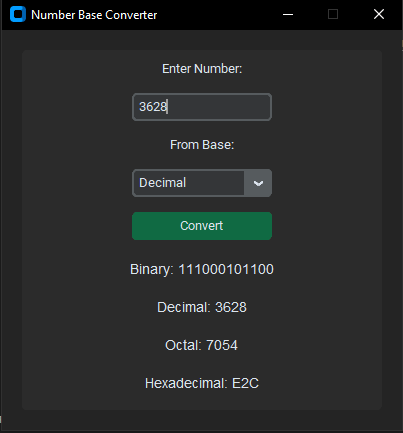

# Number Base Converter (Python + CustomTkinter)

A simple number base converter built with Python and CustomTkinter. This application allows users to convert numbers between different bases, including Binary, Decimal, Octal, and Hexadecimal.

## Features
- Convert numbers between Binary, Decimal, Octal, and Hexadecimal
- Intuitive and modern UI with `customtkinter`
- Real-time conversion updates
- Lightweight and easy to install

## Installation

### Prerequisites
Make sure you have Python installed (version 3.8 or later recommended). You can download it from [Python's official website](https://www.python.org/downloads/).

### Clone the Repository
```sh
git clone https://github.com/chochodev/Base-number-converter-rust-slint.git
cd custom-ktinker-python
```

### Install Dependencies
```sh
pip install customtkinter
```

## Usage
Run the application using:
```sh
python main.py
```

## How to Use
1. Select the number base of your input value from the dropdown menu.
2. Enter a valid number in the input field.
3. The converted values for other bases will be displayed instantly.

## Screenshot


## Contributing
Feel free to fork this repository, make modifications, and submit a pull request. Contributions are welcome!

## License
This project is licensed under the MIT License - see the [LICENSE](LICENSE) file for details.
