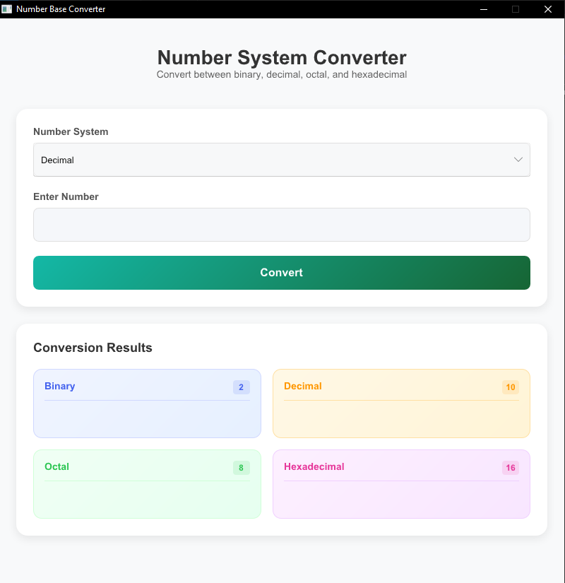

# Number Base Converter

A simple number base conversion tool built using **Slint** and **Rust**. It allows users to convert numbers between **Binary, Decimal, Octal, and Hexadecimal** formats in real time.

## 🚀 Features
- Convert between different number bases instantly
- User-friendly UI built with **Slint**
- Lightweight and efficient Rust backend
- Responsive layout with properly styled components

## 🛠️ Installation

### Prerequisites
- Rust (latest stable version) installed
- `cargo` package manager installed

### Clone the Repository
```sh
git clone https://github.com/chochodev/Base-number-converter-rust-slint.git
cd Base-number-converter-rust-slint
```

### Install Dependencies
```sh
cargo install
```

```sh
cargo build
```

### Run the Application
```sh
cargo run
```

## Usage
- Enter a number in any base
- The application will automatically convert it to **Binary, Decimal, Octal, and Hexadecimal**
- The results are displayed in a structured grid layout

## Screenshot


## 🖥️ UI Design (Slint Code)
```slint
GridBox {
    columns: 2;
    spacing: 10px;
    padding: 10px;

    Rectangle {
        width: 150px;
        height: 60px;
        border-radius: 8px;
        border-color: #ccc;
        background: #f8f8f8;
        padding: 5px;

        Text {
            text: "Binary:\n\{binary_output\}";
            font-size: 1.25rem;
            font-weight: 600;
            horizontal-alignment: center;
            vertical-alignment: center;
        }
    }
}
```

## 🛠 Technologies Used
- **Rust** - For logic
- **Slint** - For UI design

## Contributing
Contributions are welcome! Feel free to fork the repository and submit a pull request.

## License
This project is licensed under the MIT License.