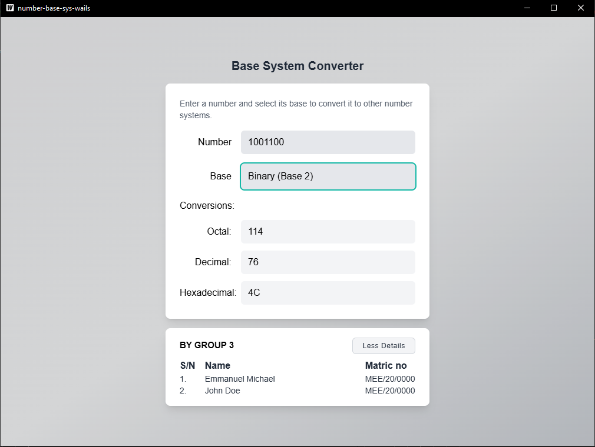

# Number Base Converter (Golang Wails + Vite-React-TS)

A cross-platform number base conversion application built with **Golang (Wails)** for the backend and **Vite + React + TypeScript** for the frontend.

## 🚀 Features
- Convert numbers between **Binary, Decimal, Octal, and Hexadecimal**
- Instant conversion and real-time UI updates
- Simple and clean user interface
- Cross-platform support (Windows, macOS, Linux)

---

## 📦 Installation & Setup

### 1️⃣ Prerequisites
Ensure you have the following installed:
- **Go** (1.21 or later) → [Download Go](https://go.dev/dl/)
- **Node.js** (LTS) & npm → [Download Node.js](https://nodejs.org/)
- **Wails CLI** → Install via:
  ```sh
  go install github.com/wailsapp/wails/v2/cmd/wails@latest
  ```
- **npm**

---

### 2️⃣ Clone the Repository
```sh
git clone https://github.com/chochodev/Base-number-converter-rust-slint.git
cd wails-go
```

---

### 3️⃣ Install Frontend Dependencies
```sh
cd frontend
npm install
```

---

### 4️⃣ Run the Application
#### Development Mode (Hot Reloading)
```sh
wails dev
```
This will start both the Wails backend and the Vite React frontend in development mode.

#### Build for Production
```sh
wails build -platform windows/amd64
```
Replace `windows/amd64` with your target platform (e.g., `darwin/arm64` for macOS M1/M2 or `linux/amd64` for Linux).

---

## 📁 Project Structure
```
number-base-converter-wails/
├── frontend/          # Vite + React + TypeScript frontend
│   ├── src/
│   ├── index.html
│   ├── package.json
│   ├── vite.config.ts
│   └── tsconfig.json
│
├── build/             # Compiled app (after build)
├── backend/           # Golang backend (Wails app)
│   ├── main.go
│   └── app.go
│
├── wails.json         # Wails configuration file
└── README.md          # Documentation
```

---
## Screenshot


---

## Customization
Modify the UI inside `frontend/src/` to adjust the design and interactivity.

---

## Contributing
Feel free to submit issues or pull requests to improve the application.

---

## License
This project is licensed under the [MIT License](LICENSE).

